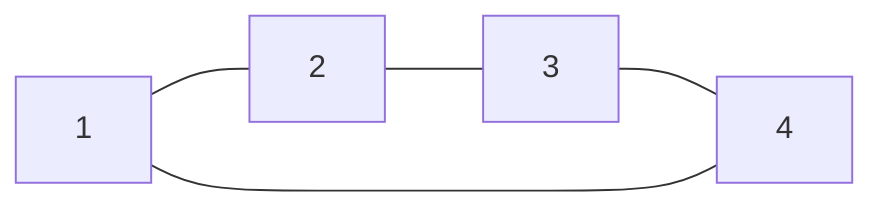
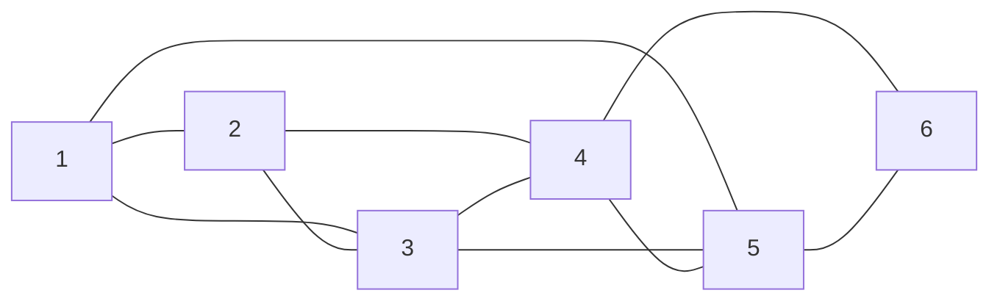

You are given a reference to one node of a **connected undirected graph**. Every node holds an integer value and a list of its neighbors:

```typescript
class GraphNode {
  val: number
  neighbors: GraphNode[]
}
```

Return a **deep copy** of the graph: a new set of nodes with the same values and the same connections, sharing **no node objects** with the original. Returning the node you were given (or any node reachable from it) is not a clone and will be rejected.

## How tests encode the graph

Object graphs can contain cycles, so test cases describe them as an **adjacency list**: node `i` (1-indexed) has value `i`, and `adjList[i - 1]` lists the values of its neighbors. Your function receives a real, already-constructed node graph — the adjacency list is only the storage format. Your returned clone is converted back to an adjacency list for comparison.

## Examples

**Example 1**

```
Input:  adjList = [[2,4],[1,3],[2,4],[1,3]]
Output: [[2,4],[1,3],[2,4],[1,3]]
```

A square: 1—2, 2—3, 3—4, 4—1. The clone has the same shape, built from brand-new nodes.



Here is a denser connected graph in the same adjacency-list style, just to make the structure easier to visualize:

```
adjList = [[2,3,5],[1,3,4],[1,2,4,5],[2,3,5,6],[1,3,4,6],[4,5]]
```



**Example 2**

```
Input:  adjList = [[]]
Output: [[]]
```

A single node with value 1 and no neighbors.

**Example 3**

```
Input:  adjList = []
Output: []
```

An empty graph: your function receives `null` and should return `null` (Python: `None`).

## Constraints

- `0 <= number of nodes <= 100`
- `1 <= node.val <= 100`, all values unique
- No self-loops or repeated edges; the graph is connected.

> **The point of this exercise:** every node is reachable from every other, and the graph contains cycles — so a naive recursive copy without a visited map recurses forever. Track original → clone as you go.
